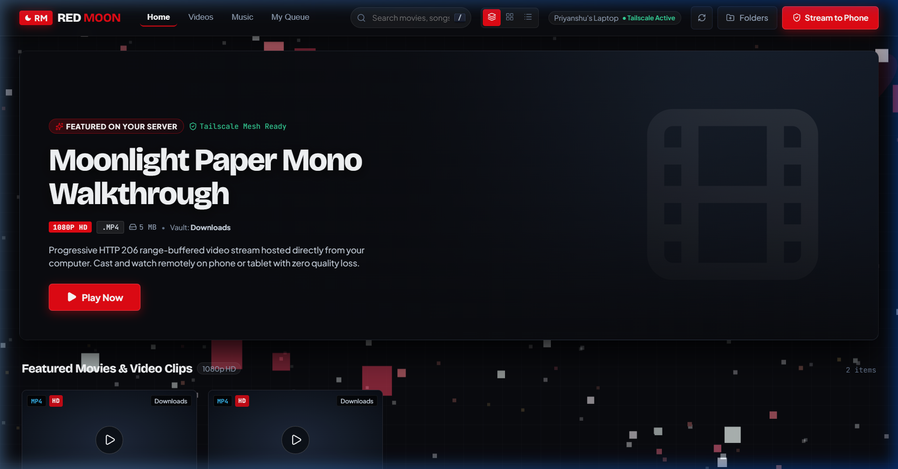
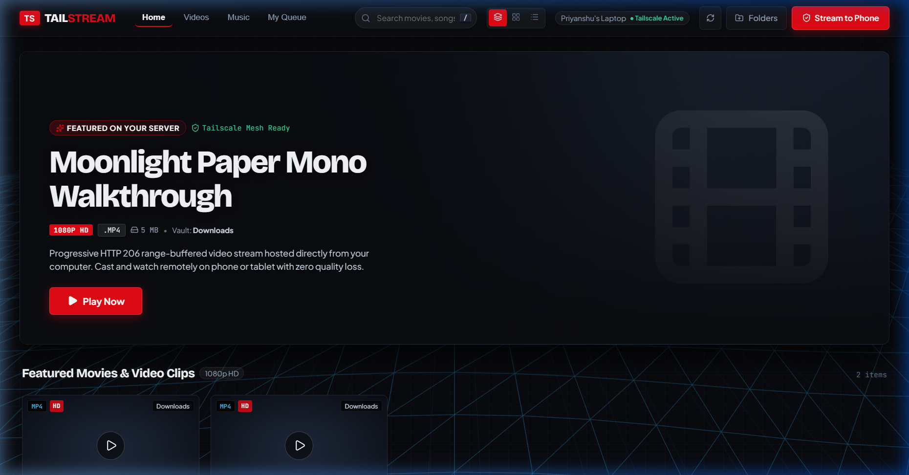
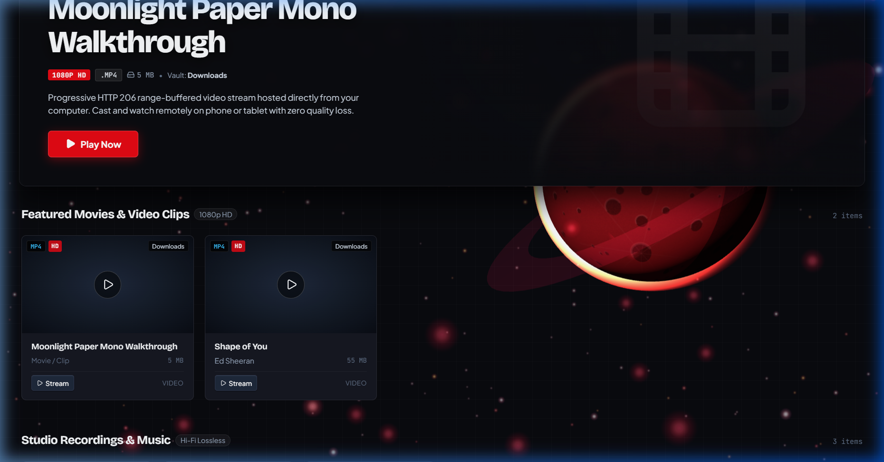
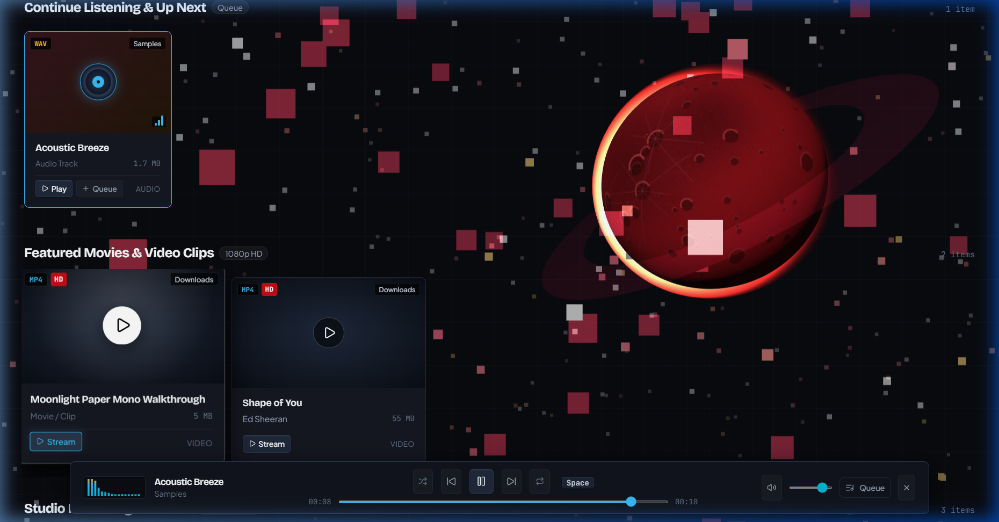
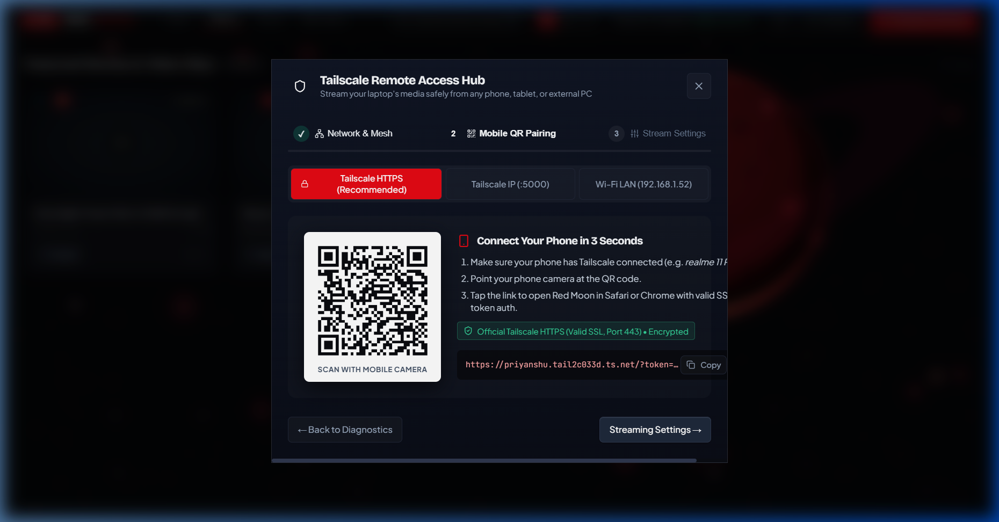
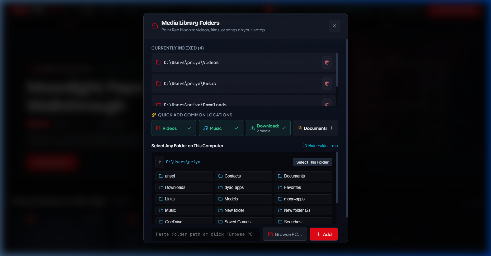
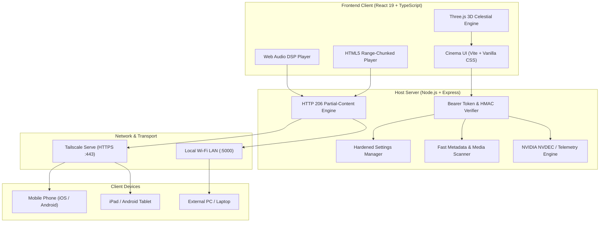

<div align="center">

# 🌑 RED MOON

### *Ultra-Fast Personal Cinema & Private Media Cloud with Peer-to-Peer Mobile Streaming*

[](LICENSE)
[](.github/workflows/ci.yml)
[](https://nodejs.org/)
[](https://react.dev/)
[](https://www.typescriptlang.org/)
[](https://tailscale.com/)
[](https://developer.nvidia.com/)
[](SECURITY.md)
[](#-1-click-standalone-executable)

<br/>

**Red Moon** is a lightweight, zero-cloud personal cinema and audio streaming server.  
Stream your local 4K movies, TV series, anime, and lossless music directly from your laptop or PC to any phone, tablet, or external device anywhere in the world—with **instant peer-to-peer Tailscale HTTPS**, **NVIDIA hardware acceleration**, and **zero port-forwarding**.

[Key Features](#-key-features) • [Showcase](#-showcase) • [Red Moon vs Others](#-competitive-comparison) • [Quickstart](#-quickstart) • [Architecture](#-architecture) • [Security](#-security--appsec-hardening)

</div>

---

## 📸 Showcase

### 🎬 Cinema Billboard & 3D Celestial Cosmos
Real-time Three.js coronal particle field, solar flare physics, and dynamic Netflix-style backdrop teasers with instant resume.

<div align="center">
  
</div>

<br/>

### 📱 Responsive Cinema Rails & Touch Navigation
Curated horizontal streaming rails, responsive tablet/mobile viewports, and custom library filtering.

<div align="center">
  
</div>

<br/>

### ⚡ 4K Video Player with Cinema HDR & Hardware Acceleration
Direct range-chunked streaming with custom color grading (Vivid, Cinema Warm, High Contrast) and hardware decoding.

<div align="center">
  
</div>

<br/>

### 🎧 Spotify-Style Audiophile Dock & Web Audio DSP
Persistent audio player with live frequency spectrum visualization, custom equalizers, and seamless background playback.

<div align="center">
  
</div>

<br/>

### 🔒 1-Scan Mobile Pairing over Tailscale HTTPS
Instant remote pairing with Let's Encrypt certificates over standard port 443—zero router configuration, zero exposed public IP.

<div align="center">
  
</div>

<br/>

### 📁 Granular Zero-Default Storage Picker
Native Windows file dialog integration and strict permission boundaries—Red Moon never touches folders you don't explicitly grant.

<div align="center">
  
</div>

---

## 🥊 Competitive Comparison

Why use Red Moon over legacy media servers?

| Feature | 🌑 Red Moon | 🟠 Plex Media Server | 🟢 Jellyfin | 🔵 Moonlight |
| :--- | :---: | :---: | :---: | :---: |
| **Download & Distro Size** | **58.6 MB** (Single Exe) | ~450 MB | ~350 MB + .NET | ~120 MB |
| **Cloud Account Requirement** | **Zero (100% Offline/Private)** | Mandatory `plex.tv` account | Optional | None (LAN-only) |
| **Remote Mobile Streaming** | **Instant Tailscale HTTPS (Port 443)** | UPnP / Port Forwarding / Relay | Complex Nginx/Caddy setup | Port-forwarding / Sunshine |
| **Hardware Video Acceleration** | **Free (Direct NVDEC / WebCodecs)** | Paywalled behind $120 Plex Pass | Free (FFmpeg VAAPI/NVENC) | Free (Host GPU) |
| **Storage Privacy Model** | **Zero-Default (Explicit Opt-In)** | Full drive crawler & telemetry | Full filesystem scanner | Steam / Game directories |
| **Interactive 3D Visuals** | **Three.js Solar Coronal Canvas** | None (Static UI) | None (Static UI) | Minimal UI |
| **Audiophile Mini-Player** | **Built-in Spotify Dock + Web Audio DSP** | Requires separate Plexamp app | Basic web audio | N/A |
| **Native Single-Click Launcher** | **Yes (`RedMoon.exe` portable)** | Requires background tray installer | Requires Windows Service setup | Separate client/server apps |

---

## ✨ Key Features

- **🎬 True Netflix-Grade Experience**: High-fidelity carousel rails, dynamic hero spotlight trailers, studio table view, and range-based HTTP 206 video chunking.
- **🌑 Interactive 3D Cosmic Atmosphere**: Real-time Three.js WebGL red moon background with coronal shockwave physics, solar flare particle bursts, and touch raycasting.
- **📱 Peer-to-Peer Mobile Streaming**: Built-in Tailscale Serve integration generates automated Let's Encrypt HTTPS URLs and QR codes for effortless remote phone playback on 5G/LTE.
- **📶 Automatic LAN Fallback**: Not using a VPN? Switch to the Local Wi-Fi LAN tab with one click to stream seamlessly across your home network.
- **🎧 High-Fidelity Audio Mini-Player**: Bottom-dock music player with playlist queueing, seek scrubbing, volume control, and continuous background audio playback while browsing.
- **🎮 NVIDIA Hardware Acceleration**: Built-in GPU telemetry and DirectX / NVDEC decoding boost to ensure silky 60fps video playback with zero dropped frames.
- **📁 Granular Media Folder Management**:
  - **1-Click Quick Add Chips** for default Windows folders (`Videos`, `Music`, `Downloads`, `Documents`).
  - **Native Windows Folder Picker** (`Browse PC...`) to select any folder visually with zero manual path typing.
  - **Interactive Tree Browser** to navigate subdirectories and storage partitions directly in the UI.
- **📦 Portable 58MB Executable**: Package your entire media server into a single portable `.exe` with zero runtime dependencies.

---

## ⚡ Quickstart

### Option 1: 1-Click Standalone Executable (Windows)

If using the portable release:
1. Download `RedMoon.exe` from [Releases](https://github.com/Priyanshu459/Red_Moon/releases).
2. Double-click **`RedMoon.exe`**.
3. Your default web browser will automatically open to `http://localhost:5000`.
4. Click **`● Point Folder`** in the header to select your media folder.
5. Click the **Tailscale Shield** icon to scan the QR code on your phone and stream!

---

### Option 2: Run From Source (Cross-Platform)

```bash
# 1. Clone the repository
git clone https://github.com/Priyanshu459/Red_Moon.git
cd Red_Moon

# 2. Install dependencies
npm install

# 3. Start the backend server (Port 5000)
node server/index.js

# 4. In a second terminal, start the frontend dev server (Port 5173)
npm run dev
```

Open `http://localhost:5173` in your browser.

---

### Option 3: Production Build & Packaging

```bash
# Build the production React/Vite bundle
npm run build

# Package into a standalone Windows binary (dist-app/RedMoon.exe)
npm run build:exe
```

---

## 📡 Remote Streaming via Tailscale

To stream your media library to your phone while outside your home network:

1. Install [Tailscale](https://tailscale.com/) on your host computer and mobile device.
2. Sign in with the same Tailscale account on both devices.
3. In Red Moon, click the **Tailscale (Shield)** icon in the header.
4. Scan the QR code with your phone camera or copy the secure HTTPS MagicDNS link.
5. Enjoy crystal-clear remote playback over cellular data (5G/LTE) with zero router port-forwarding!

> For full configuration details, refer to the [**Tailscale Setup Guide**](TAILSCALE_SETUP_GUIDE.md).

---

## 🔒 Security & AppSec Hardening

Red Moon is built from the ground up with defensive security best practices:

- **256-Bit Cryptographic Bearer Tokens**: Master authentication keys generated via `crypto.randomBytes(32)` safeguard all REST management endpoints (`/api/settings`, `/api/folders`, `/api/media/refresh`).
- **Timing-Attack Immunity**: Token validations use `crypto.timingSafeEqual` constant-time verification.
- **CWE-78 Elimination**: Replaced unsanitized shell executions with parameterized `child_process.execFileSync` argument arrays.
- **CWE-1321 Mitigation**: Deep object cloning and key filtering (`__proto__`, `constructor`, `prototype`) prevent prototype pollution attacks.
- **Strict Path Containment**: Media requests are normalized and validated to ensure no file outside registered media roots can be accessed (mitigating directory traversal).
- **Zero-Dependency Leaks**: Automated `npm audit` scans ensure 0 high or critical vulnerabilities.

Read our complete [**Security Policy**](SECURITY.md) for vulnerability reporting and architecture specifications.

---

## 🏗️ Architecture



---

## 🛠️ Tech Stack

- **Frontend**: [React 19](https://react.dev/), [TypeScript](https://www.typescriptlang.org/), [Vite](https://vitejs.dev/), [Three.js](https://threejs.org/), [Lucide Icons](https://lucide.dev/), Custom Glassmorphism CSS Design System.
- **Backend**: [Node.js](https://nodejs.org/) (20+ / 22 LTS), [Express](https://expressjs.com/), Native Crypto, PowerShell WinForms Automation.
- **Networking**: [Tailscale](https://tailscale.com/) CLI Integration, MagicDNS, Automated Let's Encrypt TLS.
- **Packaging**: ESBuild, Native Node.js Sea / Inlined Distribution.

---

## 🤝 Contributing

Contributions are warmly welcome! Whether you are submitting a bug fix, improving the 3D particle shaders, or suggesting new audio equalizer profiles, please check our [**Contributing Guide**](CONTRIBUTING.md) to get started.

---

## 📄 License

Distributed under the **MIT License**. See [**`LICENSE`**](LICENSE) for more information.

---

<div align="center">
  <sub>Built with 🖤 by <a href="https://github.com/Priyanshu459">Priyanshu</a> and the open-source community.</sub>
</div>
